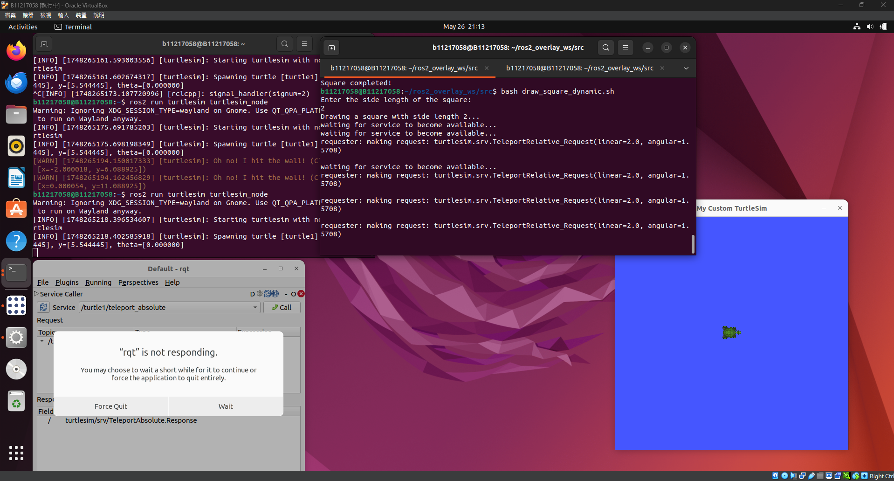
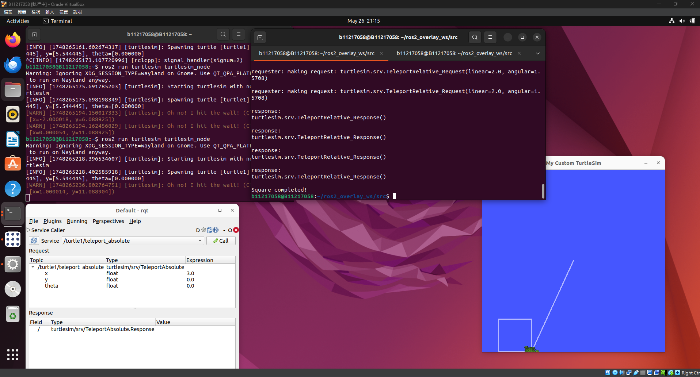
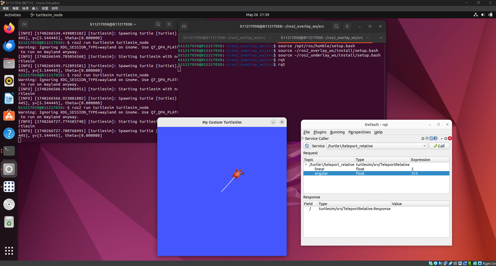
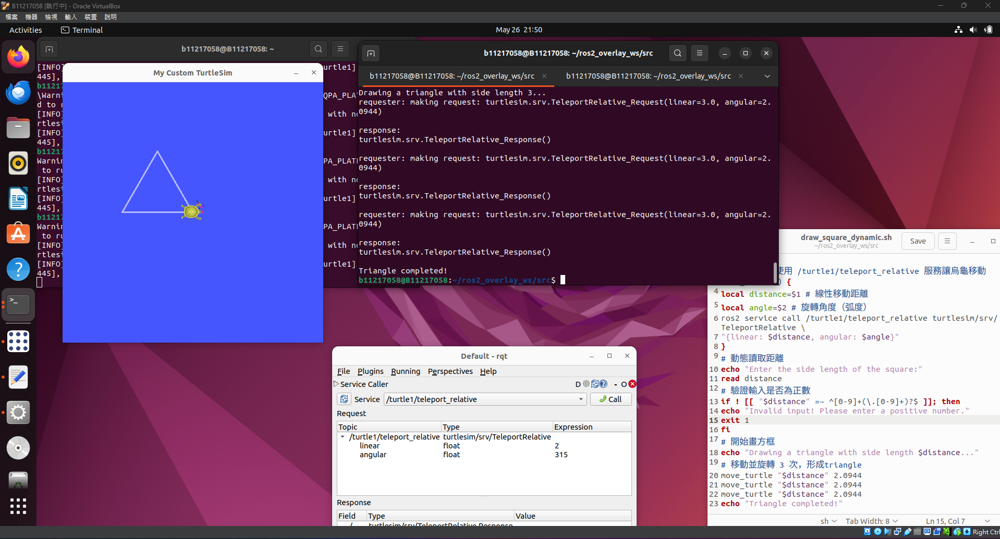

## 一、修改 /teleport_relative ⽅法，並在其中加⼊ 10 秒延遲 (看你是否來得及截圖，建議10秒以上 ) 。
>  延遲狀態中
>  
> 
>  
>  延遲結束顯示烏龜移動結果
>  
>  
>  
## 二、在 rqt 中調⽤，將烏⿔朝 往左上⽅45⾓，移動 2.0 單位 。
>  
> 
>  
# 三、編寫 Shell 腳本，透過 /teleport_relative 控制烏⿔繪製邊⻑ 3.0 單位的正三⾓形 。
>  
> 