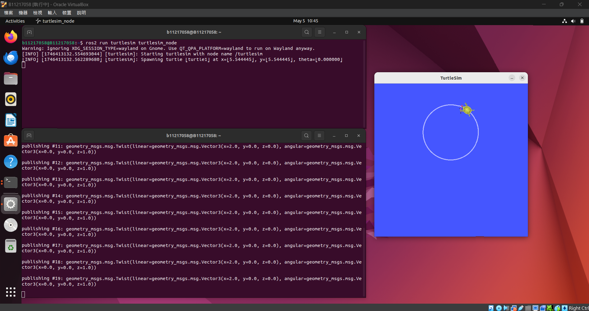
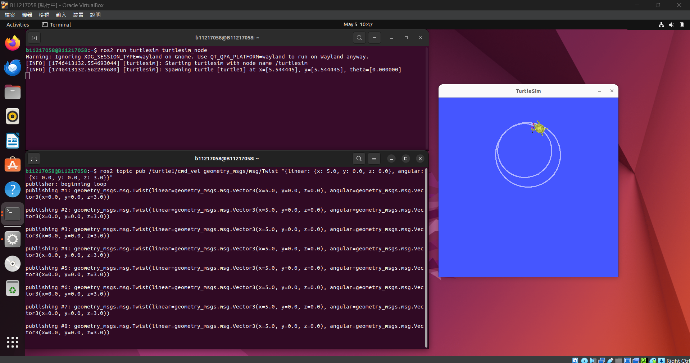
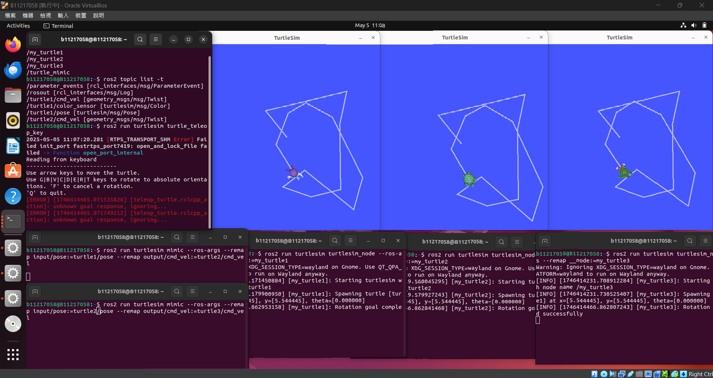

# 範例1
> ## 上方的終端機為生成烏龜
> ## 指令為：ros2 run turtlesim turtlesim_node
> ## 下方的終端機為發布指令讓烏龜以直線速度 2.0，⾓速度 1.0 移動
> ## 指令為：ros2 topic pub /turtle1/cmd_vel geometry_msgs/msg/Twist "{linear: {x: 2.0, y: 0.0, z: 0.0}, angular: {x: 0.0, y: 0.0, z: 1.0}}"
> 

> ## 讓烏龜以直線速度 5.0，⾓速度 3.0 移動
> ## 指令為：ros2 topic pub /turtle1/cmd_vel geometry_msgs/msg/Twist "{linear: {x: 5.0, y: 0.0, z: 0.0}, angular: {x: 0.0, y: 0.0, z: 3.0}}"
> 

# 範例3
> ## TurtleSim視窗下方為生成3隻烏龜的終端機分別為 my_turtle1 my_turtle2 my_turtle3
> ## 指令為：ros2 run turtlesim turtlesim_node --ros-args --remap __node:=my_turtle
> ## 左下方為啟動mimic節點 讓turtle3模仿turtle2 turtle2模仿turtle1
> ## 指令為：ros2 run turtlesim mimic --ros-args --remap input/pose:=turtle1/pose --remap output/cmd_vel:=turtle2/cmd_vel
> ## 左上方為確認查詢目前的主題以及執行中的節點
> ## 指令為：ros2 node list 和 ros2 topic list -t
> ## 最後為啟動烏龜控制器 指令為：ros2 run turtlesim turtle_teleop_key
> 